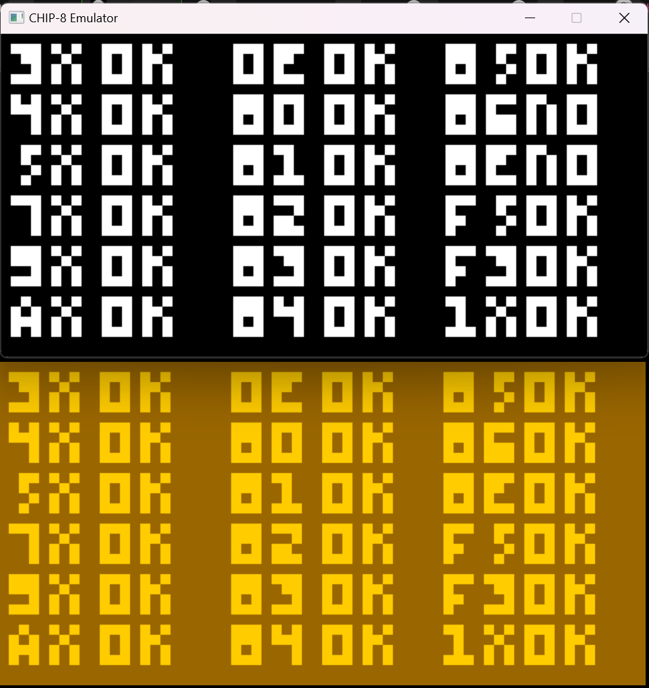

# Chip_8_Simulator

This is a project I developed to practice C++ and review some foundational concepts.

This repository contains a Chip-8 emulator, which can partially pass the [corax89's test ROM](https://github.com/corax89/chip8-test-rom). The emulator displays results using the SDL2 library.

---

## Dependencies

* [SDL2](https://www.libsdl.org/)
* Compilation and testing were performed on Windows using Visual Studio 2022 only.
# Chip_8_Simulator

这是我练习C++和复习一些基础知识而写的一个项目.

这个仓库实现了一个 Chip-8 模拟器, 它能够（部分）通过 [corax89的测试ROM](https://github.com/corax89/chip8-test-rom), 并通过SDL2库显示运行结果.

## 依赖

* [SDL2](https://www.libsdl.org/)
* 只在Windows平台上通过Visual Studio 2022进行了编译测试

---

